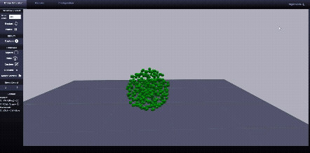
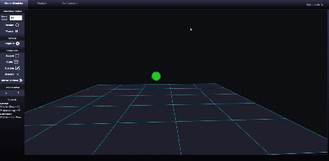
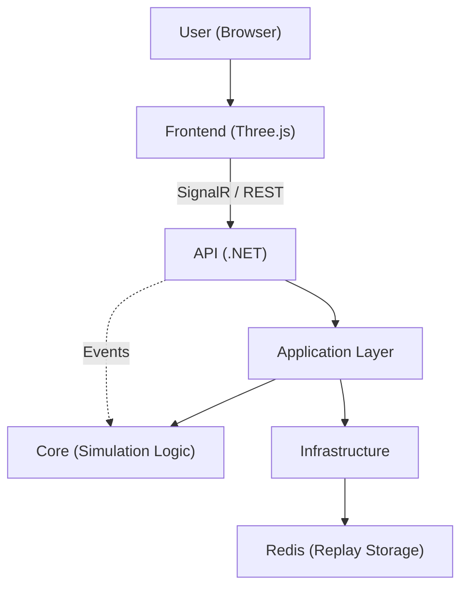

# *DroneSim*

<p align="center">
  
</p>

## Overview
DroneSim Simulator is a real-time web application that emulates large-scale drone swarms. It features a Clean Architecture backend built with .NET 9(*) and a Three.js-based frontend, enabling seamless real-time interaction between users and drone swarms through SignalR.

The simulator provides an interactive environment where users can control hundreds — or even thousands — of drones, experiment with dynamic formations, and observe emergent swarm behavior driven by boid-inspired rules. Originally conceived as a small portfolio challenge, the project became an opportunity to explore new technologies and paradigms beyond my usual comfort zone.

##### (*) Migration to .NET 10 planned upon release

<br>

## Features
- **Real-time swarm simulation:** Control hundreds to thousands of drones simultaneously with smooth updates.
- **Night mode scene visualization:** Enhanced visual mode with glowing drones and dark backgrounds for improved aesthetics.  
- **Custom formations:** Switch between predefined formations (square, cube) or draw custom formations directly on the frontend. 

<p align="center">
  
</p>

- **Interactive commands:** Move, change altitude, disband, or adjust configurable simulation parameters such as separation, cohesion, and environmental forces.
- **Replay system:** Record and playback simulations for analysis, demonstration, or just for fun, powered by Redis backend storage.
<p align="center">
  
</p>


<br>

## Installation / Usage

DroneSim Simulator is fully dockerized, allowing you to spin up the entire environment with a single command.
You can run it directly via Docker for quick deployment, or use the local .NET + Node.js setup for development and debugging.

#### Prerequisites
- Docker & Docker Compose installed
- [.NET 9 SDK](https://dotnet.microsoft.com/en-us/download/dotnet/9.0) (development only)
- Node.js (development only)

<br>

### Quick Start
```bash
git clone https://github.com/Samtlme/DroneSim
cd DroneSim/DroneSim
docker-compose up --build
```

Once the containers are running, open your browser at http://localhost:5173 to access the web interface.
##### Note: If port 5173 is already in use, Docker will automatically assign a different one — check the container logs or the terminal output for the mapped port.
<br>


## Architecture Overview
DroneSim follows a Clean Architecture design to keep the codebase modular, maintainable, and easy to extend:

- **API Layer:** Handles SignalR connections and REST endpoints for real-time communication between frontend and swarm logic.
- **Application Layer:** Orchestrates use cases like swarm control, simulation flow, and replay handling.
- **Core Layer:** Contains the simulation logic, entity definitions, and boid-inspired behavior rules.
- **Infrastructure Layer:** Implements external integrations such as Redis for replay storage and minimal middleware.

<br>

### System Diagram


<br>

### Future improvements
- .NET 10 migration upon stable release
- Setup testing framework for backend and core logic
- Frontend refactor
- Integrate logging and performance metrics
- Replay controls
- Improve UI/UX feedback on user actions
- Stop simulation automatically during inactivity periods

### Known issues
- New drones do not show glow when added to scene with night mode enabled
- Canvas click event bug under certain conditions

## License

This project is licensed under the MIT License. See the [LICENSE](./LICENSE) file for details.

